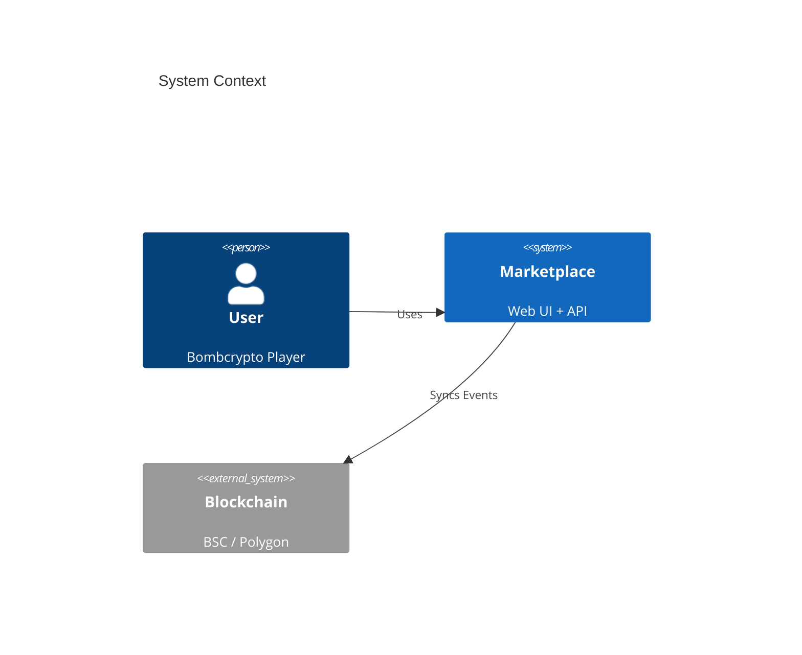

# Bombcrypto Marketplace


> **The official NFT marketplace for Bombcrypto Heroes and Houses.**
> *Secure, fast, and multi-chain trading on BSC and Polygon.*

---

## 📖 Documentation

The complete knowledge base for this project is located in the [`docs/`](docs/) directory.

| Section | Description |
|---|---|
| 🏗️ **[Architecture](docs/architecture/README.md)** | System Context, Container Diagrams, ERD, and Sequence Flows. |
| 👩‍💻 **[Developer Guide](docs/manuals/developer-guide.md)** | Setup instructions, running locally, and environment variables. |
| 🔌 **[API Reference](docs/manuals/api-reference.md)** | Detailed API endpoints and usage. |
| 📘 **[User Manual](docs/manuals/user-guide.md)** | How to buy, sell, and connect wallets. |
| 🗺️ **[Roadmap](docs/history/ROADMAP.md)** | Current status and future plans. |

---

## 🚀 Quick Start

### Prerequisites
-   Node.js v18+
-   PostgreSQL
-   Redis

### One-Liner (Docker)
*Coming soon - see Developer Guide for local setup.*

### Manual Setup
```bash
# Clone the repo
git clone <repo-url>
cd market

# Install Backend
cd backend && npm install

# Install Frontend
cd ../frontend && npm install
```

For detailed instructions on running the API, Subscribers, and Frontend, please consult the **[Developer Guide](docs/manuals/developer-guide.md)**.

---

## 🏛️ Architecture Overview

The marketplace is built using a microservices-like architecture:



See the **[full architecture documentation](docs/architecture/README.md)** for detailed C4 diagrams.

---

## 🤝 Contributing

We welcome contributions! Please see **[CONTRIBUTING.md](CONTRIBUTING.md)** for details on our code of conduct and the process for submitting pull requests.

## 📄 License

This project is licensed under the [GNU Affero General Public License v3.0](LICENSE).
