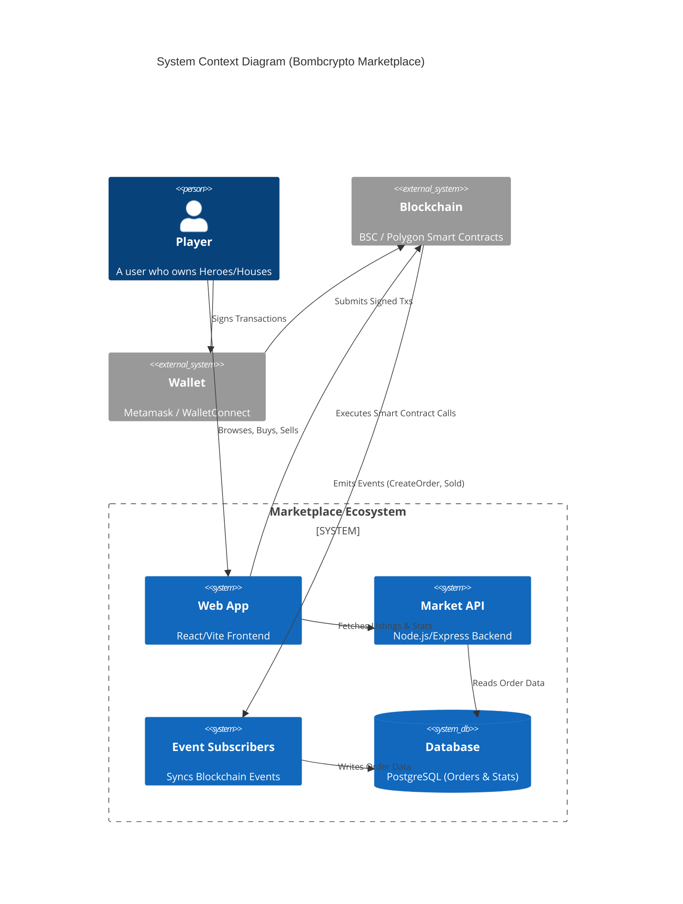

# 💣 Bombcrypto Marketplace


> **The official NFT marketplace for Bombcrypto Heroes and Houses.**
> *Secure, fast, and multi-chain trading on BSC and Polygon.*

---

## 🏛️ Architecture Overview (C4 Context)



---

## 📖 Documentation Hub

The complete knowledge base is maintained by **Deep Scribe**.

| Artifact | Description |
|---|---|
| 🗺️ **[System Atlas](docs/SYSTEM_ATLAS.md)** | **Master Inventory.** All endpoints, tables, and services. |
| 🏗️ **[Architecture](docs/ARCHITECTURE.md)** | Sequence flows, ERD, and folder structure. |
| 📓 **[Scribe's Journal](docs/SCRIBE_JOURNAL.md)** | Gap analysis, anomalies, and security notes. |
| 🔌 **[API Reference](docs/manuals/api-reference.md)** | Detailed API endpoints. |
| 👩‍💻 **[Developer Guide](docs/manuals/developer-guide.md)** | Setup and contribution. |

---

## 🚀 Quick Start

### Prerequisites
*   Node.js v18+
*   PostgreSQL
*   Redis
*   `pnpm` (Strictly enforced)

### Local Development

1.  **Clone & Install**
    ```bash
    git clone <repo>
    cd market
    pnpm install # Root dependencies
    ```

2.  **Start Backend**
    ```bash
    cd backend
    pnpm install
    # Setup .env (see Developer Guide)
    pnpm dev:api:bsc
    ```

3.  **Start Frontend**
    ```bash
    cd frontend
    pnpm install
    pnpm dev
    ```

---

## 🤝 Contributing

Please read [CONTRIBUTING.md](CONTRIBUTING.md) for details on our code of conduct, and the process for submitting pull requests.

## 📄 License

This project is licensed under the [GNU Affero General Public License v3.0](LICENSE).
