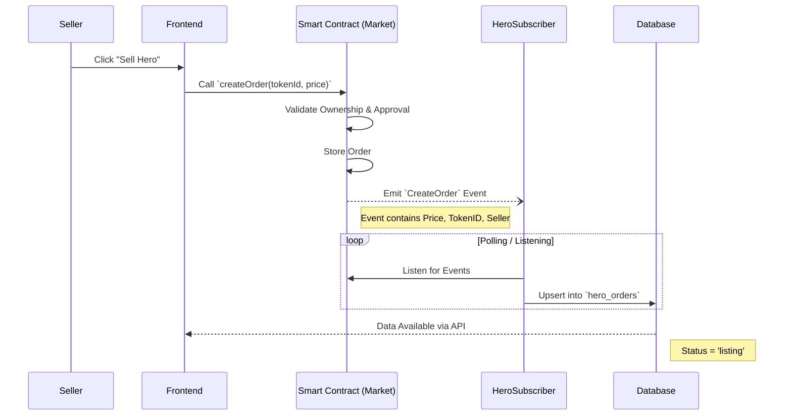
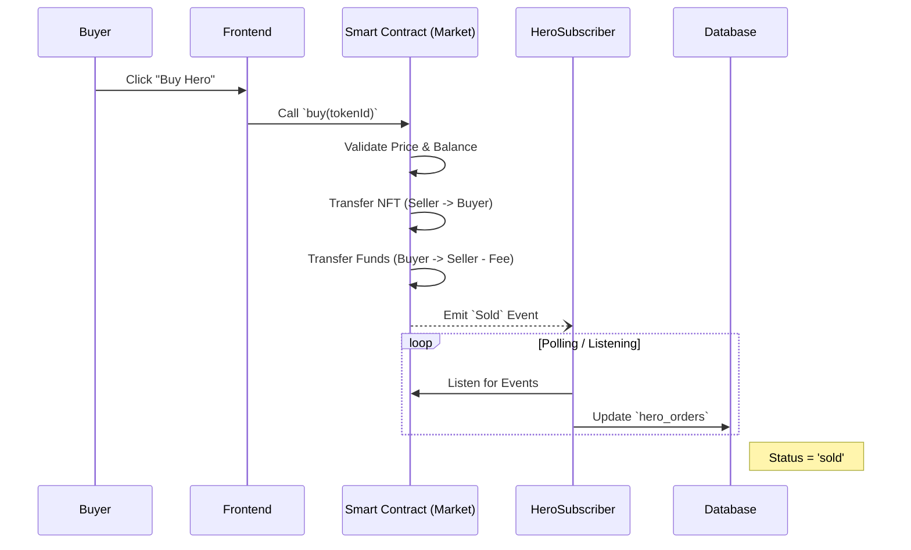
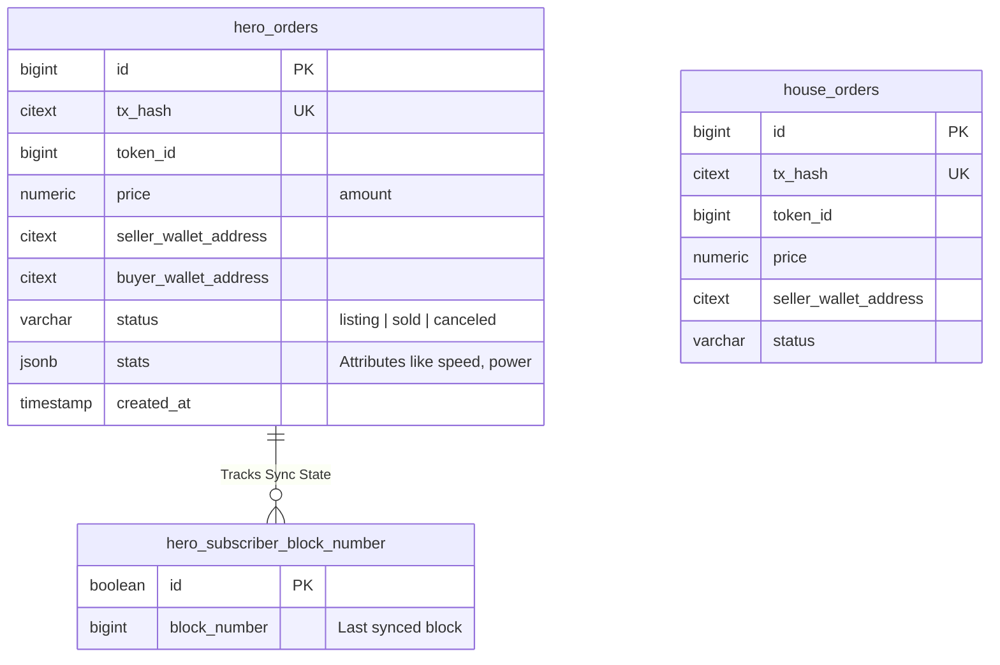

# 🏗️ Architecture & Flows

> **Status:** Live & Verified
> **Last Updated:** 2024-05-22
> **Author:** Deep Scribe

This document details the internal mechanics of the Bombcrypto Marketplace.

---

## 🔄 Critical Flows

### 1. Listing an Item (Seller Journey)

The listing process relies on an event-driven architecture. The API does **not** create listings directly; it only reads them after the blockchain event is indexed.

### 2. Buying an Item (Buyer Journey)

Similar to listing, buying is confirmed via blockchain events.

---

## 🗄️ Entity Relationship Diagram (ERD)

The database uses a schema-per-chain strategy (`bsc`, `polygon`). The structure below applies to both.

---

## 📂 Folder Structure Analysis

### `backend/` (The API & Workers)
The backend is a hybrid: it serves the API *and* runs the blockchain subscribers.
*   **`src/api/`**: Express.js REST API.
    *   `handlers/`: Request processing logic.
    *   `routes/`: URL definition.
*   **`src/subscribers/`**: The "Workers" of the system.
    *   `hero-subscriber.ts`: Listens for Hero events.
    *   `house-subscriber.ts`: Listens for House events.

### `frontend/` (The Interface)
A standard React 17 + Vite application.
*   **`src/views/`**: Page-level components (`market.tsx`).
*   **`src/components/`**: Reusable UI elements (`forms/`, `list/`).
*   **`src/context/`**: Global state (Wallet, User).

### `smc/` (The Trust Layer)
Solidity Smart Contracts managed by Truffle.
*   `contracts/MarketCore.sol`: The abstract base for marketplace logic.
*   `contracts/BHeroMarket.sol`: The concrete implementation for Heroes.
