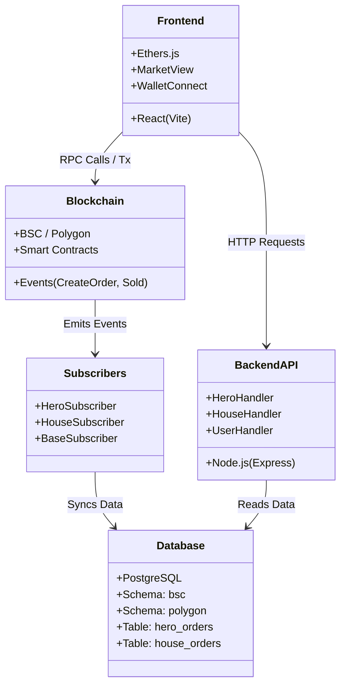

# 🗺️ System Atlas (Master Inventory)

> **Status:** Live & Verified
> **Last Updated:** 2024-05-22
> **Author:** Deep Scribe

This document acts as the single source of truth for the entire Bombcrypto Marketplace ecosystem. It lists every detected asset, service, and data structure.

---

## 🏛️ System Overview (Mermaid)

---

## 📦 Inventory

### 🔌 API Endpoints (Backend)

| Method | Endpoint | Handler | Responsibility |
|---|---|---|---|
| `GET` | `/transactions/heroes/search` | `createSearchHandler` | Filters and searches for hero listings. |
| `GET` | `/transactions/heroes/stats` | `createStatsHandler` | Aggregates market statistics for heroes. |
| `POST` | `/transactions/heroes/burn/:tokenId` | `createBurnHandler` | Removes a listing if the NFT is burned on-chain. |
| `GET` | `/transactions/heroes/version` | `createVersionHandler` | Returns API version. |
| `GET` | `/transactions/houses/search` | `HouseHandler` | Filters and searches for house listings. |
| `GET` | `/transactions/houses/stats` | `HouseHandler` | Aggregates market statistics for houses. |
| `GET` | `/admin/*` | `AdminHandler` | Administrative tasks. |
| `GET` | `/user/*` | `UserHandler` | User profile and settings. |

### 🗄️ Database Tables (PostgreSQL)

*Schemas: `bsc`, `polygon` (Identical structure)*

| Table Name | Description | Key Columns |
|---|---|---|
| `hero_orders` | Active and historical hero listings. | `id`, `tx_hash`, `token_id`, `price`, `seller`, `status` |
| `house_orders` | Active and historical house listings. | `id`, `tx_hash`, `token_id`, `price`, `seller`, `status` |
| `hero_abilities` | Many-to-many link for hero abilities. | `hero_token_id`, `ability_token_id` |
| `subs_transfer` | Tracks transfer subscriber state. | `last_block` |
| `*_subscriber_block_number` | Tracks last synced block. | `block_number` |
| `*_subscriber_failed_blocks` | Tracks failed blocks for retry. | `block_number`, `failure` |

### 🤖 Subscribers (Event Listeners)

| Subscriber | Triggers | Responsibility |
|---|---|---|
| `HeroSubscriber` | `CreateOrder`, `Sold`, `CancelOrder` | Syncs BHeroMarket events to `hero_orders`. |
| `HouseSubscriber` | `CreateOrder`, `Sold`, `CancelOrder` | Syncs BHouseMarket events to `house_orders`. |
| `BaseSubscriber` | N/A | Abstract base class for handling blockchain polling and reorgs. |

### 📜 Smart Contracts (Solidity)

| Contract | Location | Responsibility |
|---|---|---|
| `MarketCore.sol` | `smc/contracts/` | Base logic for order creation, buying, and cancelling. |
| `BHeroMarket.sol` | `smc/contracts/` | Market implementation for Heroes. |
| `BHouseMarket.sol` | `smc/contracts/` | Market implementation for Houses. |
| `BHeroDetails.sol` | `smc/contracts/` | Stores hero metadata/stats. |
| `IBEP20.sol` | `smc/contracts/` | Interface for payment tokens (BCOIN, SEN). |

---

## ✅ Feature Implementation Status

| Feature | Frontend | Backend API | Subscriber | Smart Contract | Status |
|---|---|---|---|---|---|
| **List Item** | `market.tsx` (UI) | Read-only | `handleCreateOrder` | `_createOrder` | 🟢 Complete |
| **Buy Item** | `market.tsx` (UI) | Read-only | `handleSold` | `_buy` | 🟢 Complete |
| **Cancel Listing** | `market.tsx` (UI) | Read-only | `handleCancelOrder` | `_cancelOrder` | 🟢 Complete |
| **Search/Filter** | `market.tsx` (State) | `hero.handler.ts` | N/A | N/A | 🟢 Complete |
| **Burn Item** | N/A | `createBurnHandler` | N/A | N/A | 🟡 API Only |
