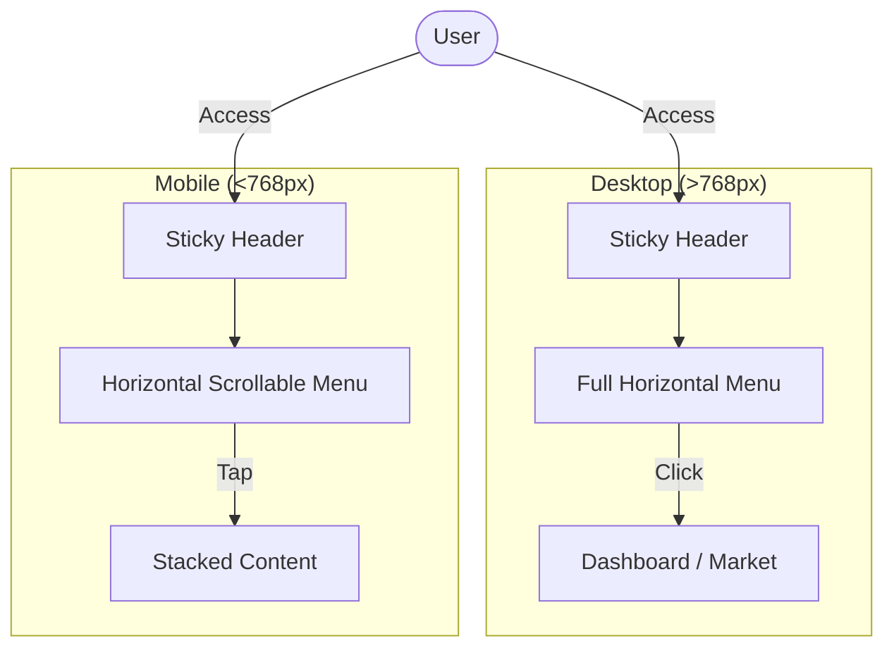
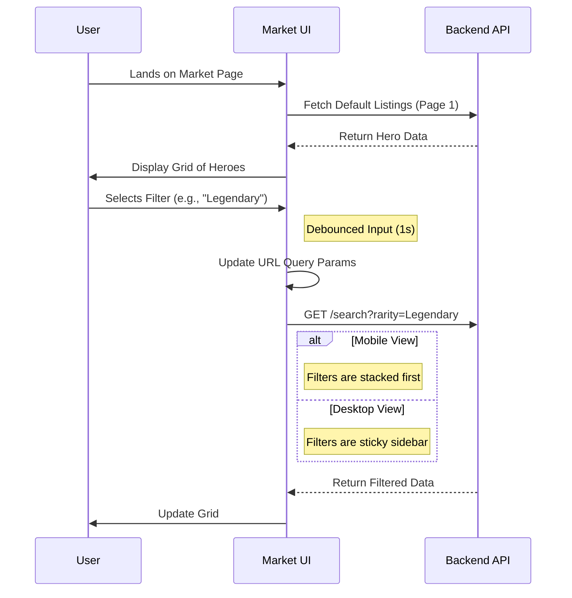

# 🎨 Vibe: UX Flow Diagrams

## 🧭 Responsive Navigation Flow

This diagram illustrates how the navigation adapts from Desktop to Mobile, prioritizing key actions.

## 🛍️ Market Filter Flow

This diagram illustrates the user journey for filtering items on the marketplace.

