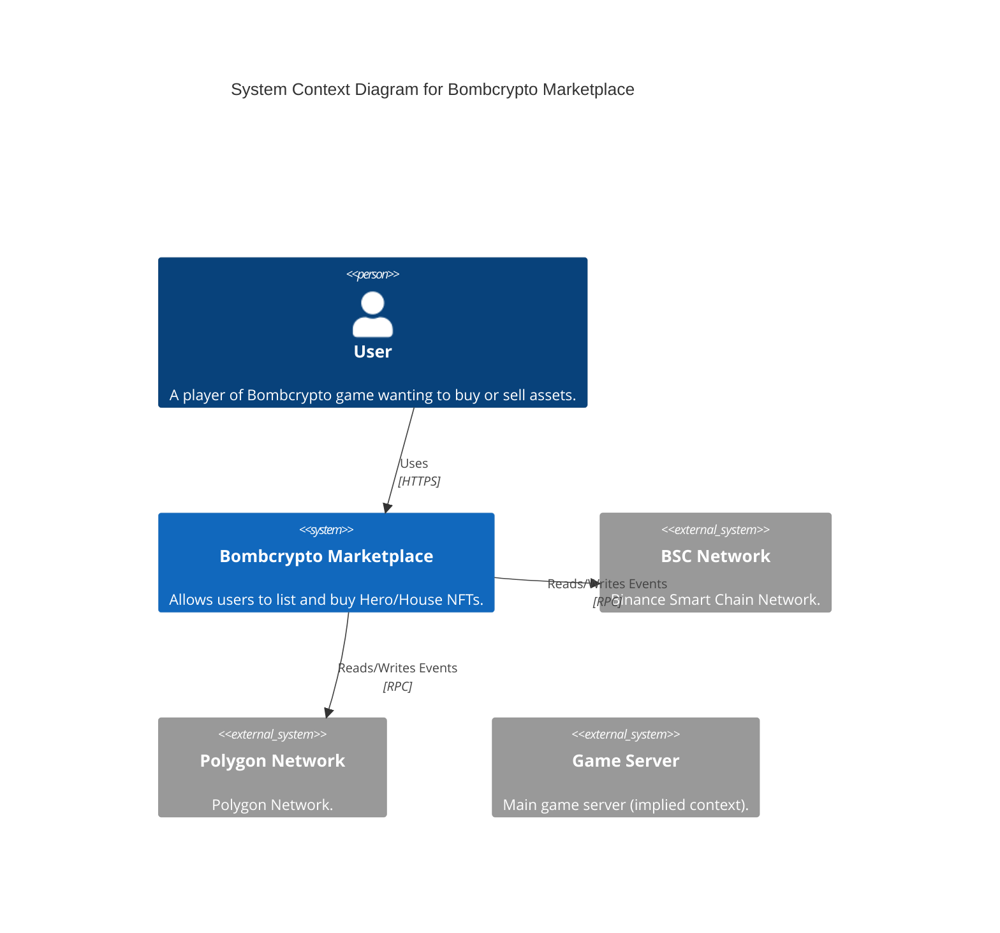

# System Architecture

## System Context (C4 Level 1)

The Bombcrypto Marketplace allows users to trade Hero and House NFTs on the Binance Smart Chain (BSC) and Polygon networks.

```mermaid
C4Context
    title System Context Diagram for Bombcrypto Marketplace

    Person(user, "User", "A player of Bombcrypto game wanting to buy or sell assets.")

    System(marketplace, "Bombcrypto Marketplace", "Allows users to list and buy Hero/House NFTs.")

    System_Ext(blockchain_bsc, "BSC Network", "Binance Smart Chain Network.")
    System_Ext(blockchain_poly, "Polygon Network", "Polygon Network.")
    System_Ext(game_logic, "Game Server", "Main game server (implied context).")

    Rel(user, marketplace, "Uses", "HTTPS")
    Rel(marketplace, blockchain_bsc, "Reads/Writes Events", "RPC")
    Rel(marketplace, blockchain_poly, "Reads/Writes Events", "RPC")
```
