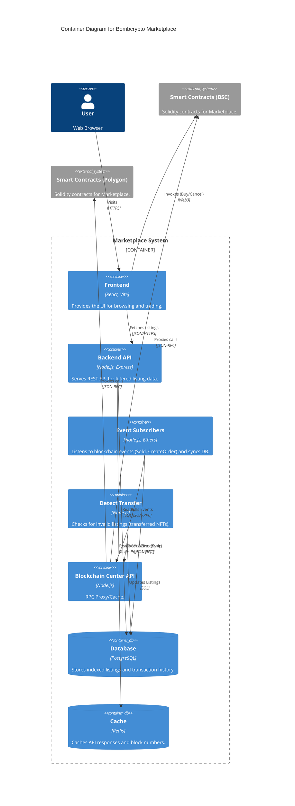

# Container Architecture

## Container Diagram (C4 Level 2)

This diagram shows the high-level containers that make up the Marketplace system.

```mermaid
C4Container
    title Container Diagram for Bombcrypto Marketplace

    Person(user, "User", "Web Browser")

    Container_Boundary(marketplace_system, "Marketplace System") {
        Container(frontend, "Frontend", "React, Vite", "Provides the UI for browsing and trading.")
        Container(backend_api, "Backend API", "Node.js, Express", "Serves REST API for filtered listing data.")
        Container(subscribers, "Event Subscribers", "Node.js, Ethers", "Listens to blockchain events (Sold, CreateOrder) and syncs DB.")
        Container(detect_transfer, "Detect Transfer", "Node.js", "Checks for invalid listings (transferred NFTs).")
        Container(blockchain_api, "Blockchain Center API", "Node.js", "RPC Proxy/Cache.")

        ContainerDb(db, "Database", "PostgreSQL", "Stores indexed listings and transaction history.")
        ContainerDb(redis, "Cache", "Redis", "Caches API responses and block numbers.")
    }

    System_Ext(smc_bsc, "Smart Contracts (BSC)", "Solidity contracts for Marketplace.")
    System_Ext(smc_poly, "Smart Contracts (Polygon)", "Solidity contracts for Marketplace.")

    Rel(user, frontend, "Visits", "HTTPS")
    Rel(frontend, backend_api, "Fetches listings", "JSON/HTTPS")
    Rel(frontend, smc_bsc, "Invokes (Buy/Cancel)", "Web3")

    Rel(backend_api, db, "Reads", "SQL")
    Rel(backend_api, redis, "Reads/Writes", "Redis Protocol")

    Rel(subscribers, blockchain_api, "Polls Events", "JSON-RPC")
    Rel(subscribers, db, "Writes (Sync)", "SQL")

    Rel(detect_transfer, blockchain_api, "Checks Ownership", "JSON-RPC")
    Rel(detect_transfer, db, "Updates Listings", "SQL")

    Rel(blockchain_api, smc_bsc, "Proxies calls", "JSON-RPC")
    Rel(blockchain_api, smc_poly, "Proxies calls", "JSON-RPC")
```
