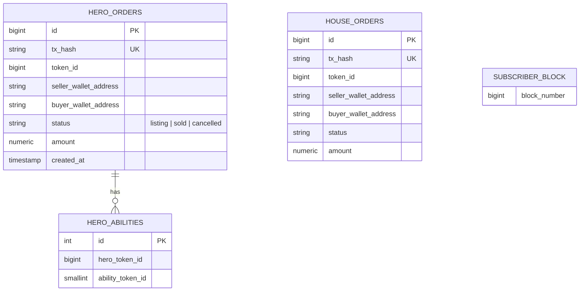

# Database Schema

## Entity Relationship Diagram

Based on the PostgreSQL schema.

```mermaid
erDiagram
    HERO_ORDERS {
        bigint id PK
        string tx_hash UK
        bigint token_id
        string seller_wallet_address
        string buyer_wallet_address
        string status "listing | sold | cancelled"
        numeric amount
        timestamp created_at
    }

    HOUSE_ORDERS {
        bigint id PK
        string tx_hash UK
        bigint token_id
        string seller_wallet_address
        string buyer_wallet_address
        string status
        numeric amount
    }

    HERO_ABILITIES {
        int id PK
        bigint hero_token_id
        smallint ability_token_id
    }

    SUBSCRIBER_BLOCK {
        bigint block_number
    }

    HERO_ORDERS ||--o{ HERO_ABILITIES : "has"
```
