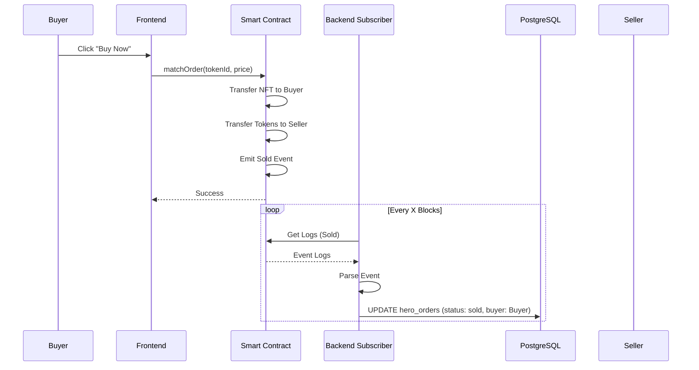

# Sequence: Buy Order

This flow describes how a user buys an NFT.

```mermaid
sequenceDiagram
    participant Buyer
    participant Frontend
    participant SMC as Smart Contract
    participant Subscriber as Backend Subscriber
    participant DB as PostgreSQL
    participant Seller

    Buyer->>Frontend: Click "Buy Now"
    Frontend->>SMC: matchOrder(tokenId, price)
    SMC->>SMC: Transfer NFT to Buyer
    SMC->>SMC: Transfer Tokens to Seller
    SMC->>SMC: Emit Sold Event
    SMC-->>Frontend: Success

    loop Every X Blocks
        Subscriber->>SMC: Get Logs (Sold)
        SMC-->>Subscriber: Event Logs
        Subscriber->>Subscriber: Parse Event
        Subscriber->>DB: UPDATE hero_orders (status: sold, buyer: Buyer)
    end
```
