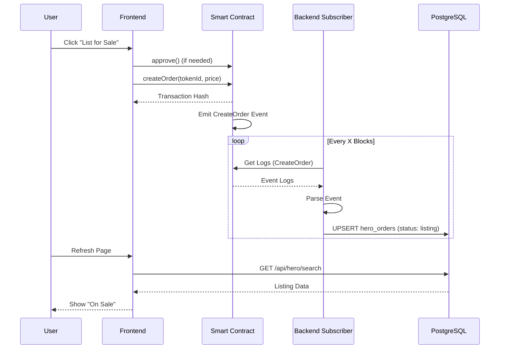

# Sequence: Create Order (Listing)

This flow describes how a user lists an NFT for sale.

```mermaid
sequenceDiagram
    participant User
    participant Frontend
    participant SMC as Smart Contract
    participant Subscriber as Backend Subscriber
    participant DB as PostgreSQL

    User->>Frontend: Click "List for Sale"
    Frontend->>SMC: approve() (if needed)
    Frontend->>SMC: createOrder(tokenId, price)
    SMC-->>Frontend: Transaction Hash
    SMC->>SMC: Emit CreateOrder Event

    loop Every X Blocks
        Subscriber->>SMC: Get Logs (CreateOrder)
        SMC-->>Subscriber: Event Logs
        Subscriber->>Subscriber: Parse Event
        Subscriber->>DB: UPSERT hero_orders (status: listing)
    end

    User->>Frontend: Refresh Page
    Frontend->>DB: GET /api/hero/search
    DB-->>Frontend: Listing Data
    Frontend-->>User: Show "On Sale"
```
